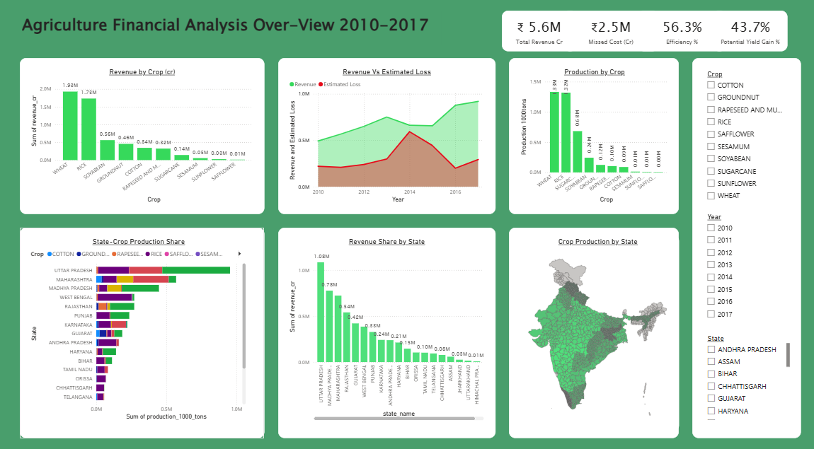
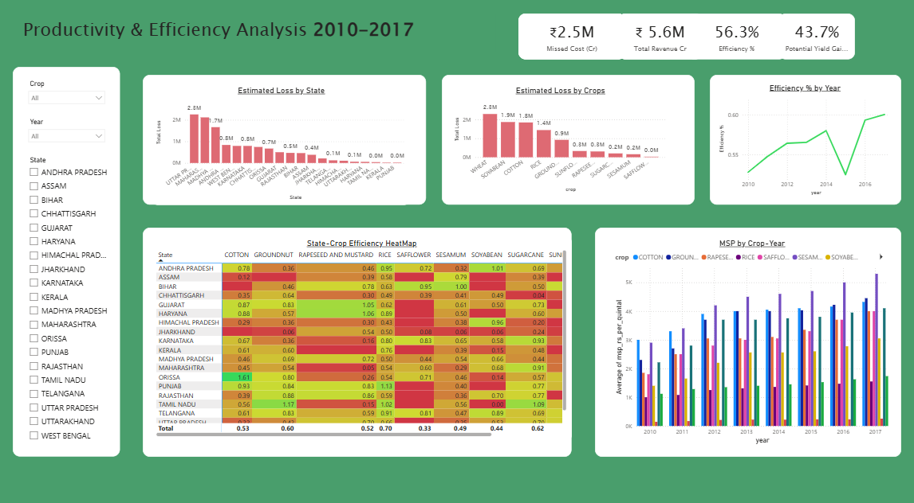
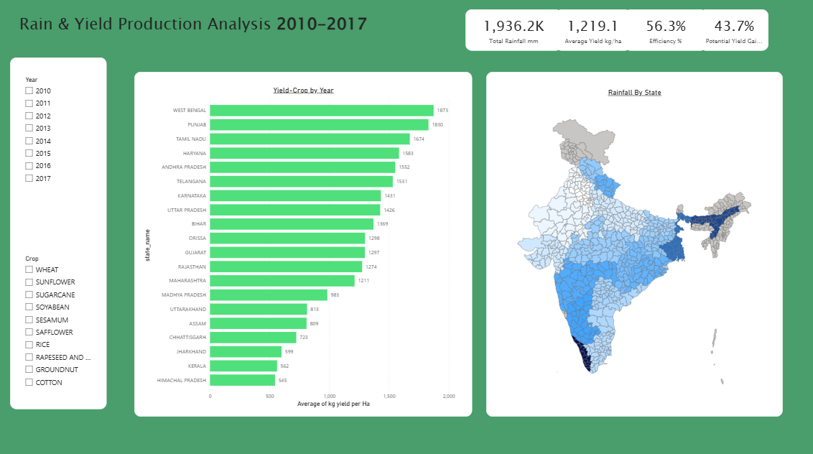

# India Agriculture Profitability & Yield Efficiency Analytics

> Measuring India's agricultural productivity gaps, unrealized farmer income, and opportunities to unlock higher crop output through efficient resource utilization.

## Overview Dashboard

## Business Problem

India possesses one of the world's largest agricultural land resources and remains one of the largest crop producers globally. Despite this advantage, the country continues to depend on imports for several edible oils and oilseed crops while millions of farmers operate with relatively low incomes.

The challenge is not simply production volume but productivity.

Large differences in crop yields exist between states despite similar crop cultivation

Significant agricultural value remains unrealized because actual yields fall far below achievable levels

Weather variability creates productivity shocks in rain dependent regions

Decision makers lack a unified view of where agricultural resources are underperforming and how much additional value could be generated through efficiency improvements

This project was built to answer one key question:

**How much additional agricultural value can India generate if existing land and resources are utilized more efficiently?**

## Tools & Technologies

| Layer                          | Tool          |
| ------------------------------ | ------------- |
| Data Cleaning & Transformation | Excel ,Python |
| Data Storage & Querying        | SQL Server    |
| Data Analysis                  | SQL, DAX      |
| Visualization & Reporting      | Power BI      |

## Dataset

Agricultural production data covering area cultivated, crop production and yield

Government MSP pricing data used for revenue estimation

State wise rainfall data used to analyze climate impact on productivity

Historical agricultural records covering 20 Indian states from 2010 to 2017

### Dataset Scope

20 States

8 Years of Historical Data

2,484 Agricultural Records

29 Crop Categories

11 Core Crops Analyzed

4,000+ Rainfall Records

## Methodology

A benchmark yield was established for every crop using the **90th percentile yield** observed across all states and years.

Yield Efficiency % was calculated as:

Actual Yield ÷ Benchmark Yield × 100

Missed Revenue Opportunity was calculated as:

(Benchmark Yield − Actual Yield) × MSP × Cultivated Area

This approach estimates the additional revenue farmers could have generated if benchmark productivity levels had been achieved using existing land resources.

## KPIs Tracked

Total Crop Production

Yield per Hectare

Yield Efficiency Percentage

Estimated Farmer Revenue

Revenue per Hectare

Missed Revenue Opportunity

High Value Crop Contribution

Rainfall vs Yield Correlation

State Productivity Ranking

Crop Productivity Ranking

## Goals & Key Insights

### 1. Identify the most profitable crops in India

**Insight:** Wheat and rice generated the largest share of agricultural revenue, contributing ₹19 lakh crore and ₹17 lakh crore respectively during the study period. While these crops dominate total value through scale, soybean, cotton and oilseeds offer substantially higher revenue potential per hectare.

### 2. Quantify unrealized agricultural value

**Insight:** Major MSP crops generated approximately ₹56 lakh crore in estimated farmer revenue between 2010 and 2017. Benchmark yield analysis revealed nearly ₹25 lakh crore in unrealized opportunity caused by productivity inefficiencies and yield gaps.

### 3. Evaluate agricultural efficiency across states

**Insight:** Average yield efficiency reached only 56% of benchmark levels. Punjab and Haryana consistently outperformed most states due to extensive irrigation coverage, while Assam, Chhattisgarh, Jharkhand and Himachal Pradesh recorded the weakest efficiency levels.

### 4. Measure weather impact on productivity

**Insight:** National yield efficiency improved from 52.8% in 2010 to 60% in 2017. The largest setback occurred during the 2014 to 2015 monsoon shock, causing a sharp decline before efficiency recovered in subsequent years.

### 5. Identify states with the largest growth opportunity

**Insight:** Uttar Pradesh and Maharashtra showed the largest unrealized agricultural value at ₹22 lakh crore and ₹21 lakh crore respectively, indicating substantial opportunities for targeted productivity improvement programs.

### 6. Assess the role of irrigation infrastructure

**Insight:** Punjab and Haryana demonstrated near zero correlation between rainfall and crop yield. Strong irrigation infrastructure insulated productivity from monsoon variability and contributed to consistently high efficiency rankings.

## Key Findings at a Glance

| Metric                          | Finding                                               |
| ------------------------------- | ----------------------------------------------------- |
| Estimated Farmer Revenue        | ₹56 lakh crore generated by major MSP crops           |
| Unrealized Revenue Opportunity  | ₹25 lakh crore lost due to productivity gaps          |
| Average Yield Efficiency        | 56% of benchmark yield levels                         |
| Revenue Growth                  | Increased 85% from ₹4.9 lakh crore to ₹9.1 lakh crore |
| Highest Revenue State           | Uttar Pradesh generated ₹10 lakh crore                |
| Largest Productivity Gap States | Uttar Pradesh and Maharashtra                         |
| Largest Productivity Gap Crops  | Wheat, Soybean, Cotton and Rice                       |
| Lowest Efficiency States        | Assam, Chhattisgarh, Jharkhand and Himachal Pradesh   |

## Dashboard Pages

| Page                             |
| -------------------------------- |
| Executive Overview               |
| Revenue & Profitability Analysis |
| Yield Efficiency Analysis        |
| State Performance Analysis       |
| Rainfall Impact Analysis         |
| Crop Opportunity Analysis        |

## Screenshots

### Overview Dashboard

### Yield Efficiency Dashboard

### Rainfall Impact Dashboard

## Recommendations Summary

### Close the Productivity Gap

Approximately 44% of potential agricultural value remains unrealized. Improving seed quality, soil health and agronomic practices could unlock substantial additional farmer income.

### Prioritize High Value Crops

Soybean, cotton, sunflower, groundnut and sesame offer stronger revenue potential per hectare and should receive greater policy and investment focus in suitable regions.

### Expand Irrigation Infrastructure

Punjab and Haryana demonstrate how irrigation reduces weather dependence and stabilizes yields. Expanding irrigation coverage in rain dependent states can significantly improve productivity.

### Focus on Low Efficiency States

Assam, Chhattisgarh, Jharkhand and Himachal Pradesh require targeted productivity programs, extension services and infrastructure investment.

### Build Climate Resilience

The productivity decline during the 2014 to 2015 monsoon shock highlights the need for stronger crop insurance coverage, contingency planning and climate adaptation measures.

### Unlock High Opportunity States

Uttar Pradesh and Maharashtra account for the largest unrealized agricultural value and should be prioritized through state specific productivity missions.

## Business Impact

### ₹56 Lakh Crore

Estimated farmer revenue generated by major MSP crops

### ₹25 Lakh Crore

Unrealized agricultural value identified through benchmark yield analysis

### 44%

Share of potential agricultural value currently left unrealized

### 85%

Growth in agricultural revenue between 2010 and 2017

## About the Dataset

20 Indian States

8 Years of Agricultural Data

2,484 Agricultural Records

11 Major Crops Analyzed

4,000+ Rainfall Records

Government MSP Pricing Data

Normalized and transformed using Excel Power Query, Python and SQL Server for analytical reporting

## Author

**Guneet Singh**

Data Analyst focused on business intelligence, SQL, Power BI and data driven decision making.

